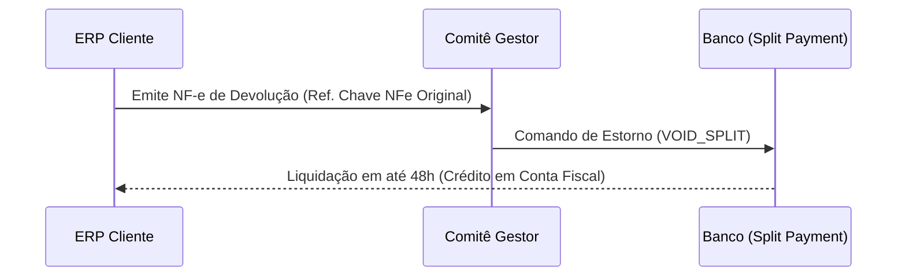

# Engenharia Tributária: Especificação Técnica Gold Master (IBS/CBS)
## Transição 2026 - 2033 | LC 214/2025 & EC 132/2023

---

### 1. Fundamentação Jurídica e Normativa (Grounding)
**Definição Jurídica:**
A Reforma Tributária sobre o consumo, instituída pela Emenda Constitucional nº 132/2023 e regulamentada pela Lei Complementar nº 214/2025, substitui o modelo fragmentado (PIS, COFINS, IPI, ICMS, ISS) pelo **IVA Dual**:
- **CBS (Contribuição sobre Bens e Serviços):** Competência Federal (substitui PIS/COFINS e parte do IPI).
- **IBS (Imposto sobre Bens e Serviços):** Competência Compartilhada/Estados e Municípios (substitui ICMS e ISS).
- **IS (Imposto Seletivo):** Extra-fiscal para desestimular consumo de bens prejudiciais (pecado).

**Regra de Ouro (Não-Cumulatividade Plena):**
O direito ao crédito não é mais limitado ao "item físico" que compõe o produto, mas sim ao **pagamento efetivo** do imposto na etapa anterior (Crédito Financeiro Pura), validado via sistema de **Split Payment**. O artigo 28 do PLP 68/2024 (Lei Complementar 214/2025) estabelece que o crédito nasce da vinculação à atividade econômica.

---

### 2. Cronograma de Transição e Shadow Period
**Definição Normativa:**
O sistema deve operar com múltiplos motores de cálculo em paralelo, disparados pela `data_competencia` e `data_liquidacao`.

**2.1 Fase de Calibração (2026):**
- **Regra:** Incidência de 0,9% (CBS) e 0,1% (IBS).
- **Compensação e Fluxo:** Os valores pagos são **compensáveis** com PIS/COFINS devidos. Se o saldo for credor, o sistema deve provisionar para ressarcimento em até 60 dias (Base legal: Art. 132 LC 214/2025).
- **Lógica ERP:** `Valor_Pago_IBS_CBS` gera um `Asset_Credit` automático na conta de impostos a recuperar.

**2.2 A Virada Federal (2027):**
- **Evento:** Extinção total de PIS e COFINS. CBS assume alíquota de referência (est. ~8,8%). 
- **IPI:** Redução a zero para a maioria (exceto ZFM).
- **Atenção:** Empresas do Lucro Presumido perdem o regime cumulativo de 3,65% e passam ao Débito/Crédito compulsório para a CBS.

**2.3 A Escada do IBS (2029-2032):**
Substituição gradual do ICMS e ISS por IBS:
- 2029: 10% IBS / 90% ICMS/ISS original.
- 2030: 20% IBS / 80% ICMS/ISS original.
- 2031: 30% IBS / 70% ICMS/ISS original.
- 2032: 40% IBS / 60% ICMS/ISS original.
- **Complexity Híbrida:** O motor de cálculo deve suportar `dual-stack tax calculation`. Uma nota fiscal terá campos reduzidos de ICMS/ISS e progressivos de IBS/CBS.

---

### 3. Simples Nacional: Arquitetura de Transição (Anexo por Anexo)

O Simples Nacional migra de um regime de "Pagamento Único" para um modelo de **Segregação Dinâmica**. O sistema deve suportar a apuração do DAS e a conciliação do Split Payment de IBS/CBS.

#### 3.1 Tabelas de Repartição 2.0 (Transição 2027-2033)

Durante o *Shadow Period*, o IBS e a CBS entram nos- **Anexos XVIII a XXII (De-Para):** A LC 214/2025 substitui tecnicamente os Anexos I-V da LC 123 pelos novos Anexos XVIII-XXII para fins de partilha IBS/CBS.

#### 3.1 Anexo XVIII (Comércio - Antigo Anexo I) - Partilha 2027/2028
| Faixa | RBT12 (Até R$) | Alíq. Nominal | Valor a Deduzir | IRPJ | CSLL | CBS* | CPP | ICMS | IBS* |
| :--- | :--- | :--- | :--- | :--- | :--- | :--- | :--- | :--- | :--- |
| 1ª | 180.000,00 | 4,00% | - | 5,50% | 3,50% | 15,33% | 41,50% | 34,00% | 0,17% |
| 2ª | 360.000,00 | 7,30% | 5.940,00 | 5,50% | 3,50% | 15,33% | 41,50% | 34,00% | 0,17% |
| 3ª | 720.000,00 | 9,50% | 13.860,00 | 5,50% | 3,50% | 15,33% | 41,50% | 34,00% | 0,17% |
| 4ª | 1.800.000,00 | 10,70% | 22.500,00 | 5,50% | 3,50% | 15,33% | 41,50% | 34,00% | 0,17% |
| 5ª | 3.600.000,00 | 14,30% | 87.300,00 | 5,50% | 3,50% | 15,33% | 41,50% | 34,00% | 0,17% |
| 6ª | 4.800.000,00 | 19,00% | 378.000,00 | 13,50%| 10,00%| 34,40% | 42,10% | -** | -** |
*CBS substitui PIS/COFINS. IBS é alíquota teste. **Acima de R$ 3,6M, ICMS e IBS são recolhidos por fora.*

#### 3.2 Anexo XIX (Indústria - Antigo Anexo II) - Partilha 2027/2028
| Faixa | RBT12 (Até R$) | Alíq. Nominal | Valor a Deduzir | IRPJ | CSLL | CBS | CPP | IPI | ICMS | IBS |
| :--- | :--- | :--- | :--- | :--- | :--- | :--- | :--- | :--- | :--- | :--- |
| 1ª | 180.000,00 | 4,50% | - | 5,50% | 3,50% | 15,50%| 42,00%| 20,00%| 13,35%| 0,15% |
| 2ª | 360.000,00 | 7,80% | 5.940,00 | 5,50% | 3,50% | 15,50%| 42,00%| 20,00%| 13,35%| 0,15% |
| 3ª | 720.000,00 | 10,00% | 13.860,00 | 5,50% | 3,50% | 15,50%| 42,00%| 20,00%| 13,35%| 0,15% |
| 4ª | 1.800.000,00 | 11,20% | 22.500,00 | 5,50% | 3,50% | 15,50%| 42,00%| 20,00%| 13,35%| 0,15% |
| 5ª | 3.600.000,00 | 14,70% | 85.500,00 | 5,50% | 3,50% | 15,50%| 42,00%| 20,00%| 13,35%| 0,15% |
| 6ª | 4.800.000,00 | 30,00% | 720.000,00 | 8,50% | 7,50% | 25,50%| 23,50%| 35,00%| - | - |

#### 3.3 Anexo XX (Serviços - Antigo Anexo III) - Partilha 2027/2028
| Faixa | RBT12 (Até R$) | Alíq. Nominal | Valor a Deduzir | IRPJ | CSLL | CBS | CPP | ISS | IBS |
| :--- | :--- | :--- | :--- | :--- | :--- | :--- | :--- | :--- | :--- |
| 1ª | 180.000,00 | 6,00% | - | 4,00% | 3,50% | 15,43%| 43,40%| 33,50%| 0,17% |
| 2ª | 360.000,00 | 11,20% | 9.360,00 | 4,00% | 3,50% | 16,91%| 43,40%| 32,00%| 0,19% |
| 3ª | 720.000,00 | 13,50% | 17.640,00 | 4,00% | 3,50% | 16,42%| 43,40%| 32,50%| 0,18% |
| 4ª | 1.800.000,00 | 16,00% | 35.640,00 | 4,00% | 3,50% | 16,42%| 43,40%| 32,50%| 0,18% |
| 5ª | 3.600.000,00 | 21,00% | 125.640,00 | 4,00% | 3,50% | 15,43%| 43,40%| 33,50%*| 0,17% |
| 6ª | 4.800.000,00 | 33,00% | 648.000,00 | 35,09%| 15,04%| 19,29%| 30,58%| - | - |
*Nota: ISS limitado a 5% efetivo.

#### 3.4 Anexo XXI (Serviços - Antigo Anexo IV) - Partilha 2027/2028
| Faixa | RBT12 (Até R$) | Alíq. Nominal | Valor a Deduzir | IRPJ | CSLL | CBS | ISS | IBS |
| :--- | :--- | :--- | :--- | :--- | :--- | :--- | :--- | :--- |
| 1ª | 180.000,00 | 4,50% | - | 18,80%| 15,20%| 21,26%| 44,50%| 0,24% |
| 2ª | 360.000,00 | 9,00% | 8.100,00 | 19,80%| 15,20%| 24,73%| 40,00%| 0,27% |
| 3ª | 720.000,00 | 10,20% | 12.420,00 | 20,80%| 15,20%| 23,74%| 40,00%| 0,26% |
| 4ª | 1.800.000,00 | 14,00% | 39.780,00 | 17,80%| 19,20%| 22,75%| 40,00%| 0,25% |
| 5ª | 3.600.000,00 | 22,00% | 183.780,00 | 18,80%| 19,20%| 21,76%| 40,00%| 0,24% |
| 6ª | 4.800.000,00 | 33,00% | 828.000,00 | 53,71%| 21,59%| 24,70%| - | - |
*CPP recolhida sobre a folha de salários conforme regras gerais (Não incluída no DAS).*

#### 3.5 Anexo XXII (Serviços - Antigo Anexo V) - Partilha 2027/2028
*Mesma estrutura de partilha do Anexo XXI, aplicada sobre alíquotas de 15,50% a 30,50% conforme Fator R.*
| Faixa | RBT12 (Até R$) | Alíq. Nominal | Valor a Deduzir | IRPJ | CSLL | CBS | ISS | IBS |
| :--- | :--- | :--- | :--- | :--- | :--- | :--- | :--- | :--- |
| 1ª | 180.000,00 | 15,50% | - | 18,80%| 15,20%| 21,26%| 44,50%| 0,24% |
| 6ª | 4.800.000,00 | 30,50% | 540.000,00 | 53,71%| 21,59%| 24,70%| - | - |

> [!NOTE]
> **O Fenômeno do Sublimite (R$ 3,6M):** Acima deste valor, o IBS e o ICMS-R saem do DAS e são apurados no Regime Regular ("Por Fora"). O ERP deve desativar os campos de IBS/ICMS no DAS e habilitar o módulo de Crédito Financeiro Amplo.

##### 3.1.2 ANEXOS III e V (Serviços e Fator R)
O Fator R (`Folha_12 / Receita_12 >= 28%`) determina se a empresa opera no Anexo III (mais barato) ou V (mais caro).
- **Anexo III (2027):** CBS recalibrada para 12,85%; IBS inicial de 0,17%.
- **Anexo V (2027):** CBS recalibrada para 16,30% (devido à maior incidência sobre serviços intelectuais).

#### 3.2 Algoritmo de Decisão: Simples Híbrido (Titan Engine)
A escolha pelo recolhimento externo de IBS/CBS ("Simples Híbrido") deve ser validada por simulação de **Paridade de Preço B2B**.

```pseudo
FUNCTION CalcPriceParity(Preco_Venda, Regime_Simples, Aliquota_Efetiva_DAS) {
    Aliq_Padrao_IVA = 0.265; // CBS + IBS (Projetado)
    
    // Crédito que o cliente B2B recupera
    IF (Regime_Simples == "PURO") {
        Credito_Cliente = Preco_Venda * Aliquota_Efetiva_DAS * Share_IBS_CBS;
    } ELSE {
        Credito_Cliente = Preco_Venda * Aliq_Padrao_IVA;
    }
    
    Custo_Efetivo_Cliente = Preco_Venda - Credito_Cliente;
    RETURN Custo_Efetivo_Cliente;
}
```
**Regra de Ouro:** Se o `Custo_Efetivo_Cliente` for > que a concorrência no Lucro Real, o sistema deve sugerir o **Modo Híbrido**.

#### 3.3 Sociedades Profissionais (Redução de 30%)
Empresas no Simples Híbrido que prestem serviços regulamentados (Médicos, Advogados, Engenheiros, Contabilistas) têm direito a **30% de redução** na alíquota de IBS/CBS "por fora".
- **Condição ERP:** Validar CNAE contra a lista de 18 profissões liberais.
- **Alíquota Híbrida:** `Aliq = 26,5% * 0,70 = 18,55%`.

#### 3.4 Nano-empreendedores (Isenção e Dispensa)
Novidade da LC 214/2025 para desoneração total:
- **Limite:** Faturamento até R$ 40.000,00 / ano (ou proporcional).
- **Regra:** Não contribuinte de IBS/CBS. Dispensado de emissão de NF-e a menos que o adquirente exija.
- **Impacto ERP:** Criar categoria de parceiro `NANO_ENTREPRENEUR` para compras sem crédito de IBS/CBS.

#### 3.5 Tratamento de Devoluções e Reverse Split
Conforme Art. 45, o estorno de IBS/CBS no Simples Nacional deve ocorrer via **Crédito de Indébito no CGIBS**.


---

### 4. Lucro Presumido: A Disrupção do Modelo (Renda vs. Consumo)

O Lucro Presumido torna-se um regime de **Apuração Híbrida**. O ERP deve aplicar a presunção para a renda (IRPJ/CSLL) e o regime real para o consumo (IBS/CBS).

#### 4.1 O "Cliff" de R$ 5 Milhões (LC 224/2025)
A partir de 2026, a presunção de lucro sofre uma majoração punitiva para empresas de médio porte.

- **Regra Técnica:** Acréscimo de **10%** sobre o percentual de presunção para a parcela da receita bruta que exceder R$ 5.000.000,00 anuais.
- **Verificação Trimestral (IN 2305/2025):** Limite de R$ 1.250.000,00/trimestre.

**Algoritmo de Presunção Majorada (IRPJ/CSLL):**
```pseudo
FUNCTION CalcPresumedBase(Receita_Trimestre, Acumulado_Ano) {
    Presuncao_Base = 0.32; // Ex: Serviços
    Limite_Trimestre = 1250000;
    
    IF (Acumulado_Ano > 5000000) {
        // Todo o faturamento do trimestre atual já entra majorado
        Base_Calculo = Receita_Trimestre * (Presuncao_Base * 1.10);
    } ELSE IF (Acumulado_Ano + Receita_Trimestre > 5000000) {
        // Apenas a parcela excedente sofre o acréscimo
        Parcela_Normal = 5000000 - Acumulado_Ano;
        Parcela_Majorada = Receita_Trimestre - Parcela_Normal;
        Base_Calculo = (Parcela_Normal * Presuncao_Base) + (Parcela_Majorada * Presuncao_Base * 1.10);
    } ELSE {
        Base_Calculo = Receita_Trimestre * Presuncao_Base;
    }
    RETURN Base_Calculo;
}
```

#### 4.2 A Virada da CBS em 2027 (Adeus 3,65%)
Em 01/01/2027, o PIS e a COFINS são extintos. A empresa abandona a alíquota cumulativa de 3,65% e assume a CBS plena (~8,8% a 9,24%).

**Regras de Transição de Estoque (Dead Level):**
Em 31/12/2026, o ERP deve gerar um inventário detalhado de itens para apropriação de **Crédito de Transição**.
- **Crédito de Abertura:** Apropriação de **9%** sobre o valor do estoque para compensar a CBS devida no 1º ano.

#### 4.3 Expansão do Crédito de Consumo (O Fim do Insumo Físico)
Anteriormente vedações no Lucro Presumido, agora elegíveis para crédito integral de IBS/CBS:
1. **Serviços Administrativos:** Contabilidade, advocacia, consultoria técnica (Redução de 30% na alíquota de saída, mas crédito integral na entrada).
2. **Infraestrutura e TI:** Assinaturas SaaS, Cloud computing, manutenção de hardware, aluguel de equipamentos.
3. **Marketing e Vendas:** Publicidade digital, agências, feiras e eventos.
4. **Utilidades:** Energia elétrica (100% da fatura), saneamento, internet, telefonia.

#### 4.4 Redução de 30% em Serviços Profissionais
Para sociedades de profissões intelectuais (Lista de 18 profissões liberais), o motor deve aplicar o redutor:
- **Alíquota Saída:** `Aliq_Efetiva = Aliquota_Padrao * 0.70`.
- **Condição de Validação:** Sócio habilitado no conselho de classe e sem sócio pessoa jurídica.

---

### 5. Split Payment: A Automação do Recolhimento Centralizado

O Split Payment é o novo paradigma de arrecadação onde o imposto é liquidado na transação financeira. O ERP deve atuar como o **Orquestrador de Conformidade**, reconciliando a NF-e com as retenções bancárias.

#### 5.1 Modalidades Operacionais (Art. 32-33 LC 214/2025)

| Recurso | Split Inteligente (Smart) | Split Simplificado (Varejo) |
| :--- | :--- | :--- |
| **Público-alvo** | B2B, Indústria, Grandes Serviços | B2C, Comércio Varejista, MEI |
| **Cálculo** | Valor exato por item da NF-e | Alíquota simbólica/fixa (Ajuste posterior) |
| **Créditos** | Considera saldo credor do vendedor (Netting) | Retenção bruta (Sem netting imediato) |
| **Timing** | Tempo real (Online) | Apuração periódica (Batch) |

#### 5.2 Algoritmo de Conciliação e "Netting" Financeiro
O ERP deve calcular a retenção líquida para prever o recebimento em conta.

```pseudo
FUNCTION CalculateSplitRetention(Valor_Venda_Bruto, Aliquota_Referencia, Saldo_Credor_Ativo) {
    Imposto_Devido = Valor_Venda_Bruto * Aliquota_Referencia;
    
    // Motor de Netting (Smart Split):
    IF (Saldo_Credor_Ativo >= Imposto_Devido) {
        Retention_Amount = 0;
        New_Balance = Saldo_Credor_Ativo - Imposto_Devido;
        Status = "SETTLED_BY_CREDIT";
    } ELSE {
        Retention_Amount = Imposto_Devido - Saldo_Credor_Ativo;
        New_Balance = 0;
        Status = "PARTIAL_RETENTION";
    }
    
    RETURN {Retention_Amount, New_Balance, Status};
}
```

#### 5.3 Governança: O Comitê Gestor (CGIBS) e o Token de Crédito
O direito ao crédito para o adquirente nasce da confirmação do recolhimento via Split.
- **CGIBS_TOKEN:** UUID gerado pelo Comitê Gestor que vincula a NF-e ao pagamento bancário.
- **Workflow de Validação:**
  1. Fornecedor emite NF-e.
  2. Banco processa pagamento e gera Hash de Retenção.
  3. CGIBS recebe Hash e libera `CGIBS_TOKEN` para o ERP do Comprador.
  4. ERP do Comprador apropria o crédito no Ativo Fiscal apenas após a recepção do Token.

#### 5.4 Responsabilidade Solidária e Error Handling
Se o mecanismo de Split falhar (ex: pagamento via dinheiro ou cheque sem retenção), o sistema deve:
- **Alert:** "Risco de Responsabilidade Solidária - Imposto não segregado na origem".
- **Ação:** Provisionar o débito para pagamento via guia avulsa (GNRE 2.0) e suspender o crédito do adquirente até a regularização.

#### 5.5 Gestão do Capital de Giro
O Split Payment elimina o float financeiro do imposto (D+30 para o caixa da empresa). 
- **Lógica de Tesouraria:** O ERP deve projetar fluxos de caixa considerando apenas o **Valor Líquido** das faturas vendidas, ajustando os indicadores de liquidez corrente para a nova realidade de "caixa seco" de tributos.

---

### 6. Regimes Específicos e Algoritmos Setoriais

Determinados setores abandonam a alíquota padrão em favor de bases de cálculo reduzidas ou regimes monofásicos. O ERP deve chavear o motor de cálculo conforme o **NCM/CNAE** e a **Localização (ZFM)**.

#### 6.1 Setor Imobiliário: Incorporação, Venda e Locação
O imposto incide sobre o valor agregado, mas com redutores severos e dedução de custo de aquisição de terreno.

- **Redutores Setoriais:** 
  - Venda de Imóveis / Construção Civil: **60%** (Aliq. Ef. ~10,6%).
  - Locação de Imóveis: **80%** (Aliq. Ef. ~5,3%).
- **Algoritmo de Base Imobiliária (Titan logic):**
  `Base_Calculo = (Valor_Venda - Valor_Terreno_Aquisicao) * (1 - Redutor_Setorial)`
- **Nano-empreendedor Imobiliário:** PF que vende até 3 imóveis/ano ou fatura < R$ 40k é **Isento** de IBS/CBS.

#### 6.2 Combustíveis: O Regime Monofásico Ad Rem
A incidência ocorre apenas na refinaria/importador com alíquota fixa por unidade (R$/Litro).

- **Regra de Crédito para Transportadoras:**
  Diferente da regra geral (tributo x tributo), aqui o crédito é gerado pela **quantidade física**.
  `Credito_Apropriado = Litros_Abastecidos * Aliquota_Ad_Rem_NF`
  - **Atenção:** Vedado crédito para revenda (Postos). Apenas para consumo como insumo (Frota).

#### 6.3 Zona Franca de Manaus (ZFM) e ALCs
Preservação da competitividade regional via isenção na entrada e crédito presumido na saída.

| Operação | Tratamento IBS/CBS | Geração de Crédito |
| :--- | :--- | :--- |
| Venda Nacional -> ZFM | Alíquota Zero (Art. 92-A) | Crédito Presumido 13,5% (Origem N/NE/CO) ou 7,5% (S/SE) |
| Indústria ZFM -> Nacional | Incidência Normal | Crédito Presumido (55% Consumo, 75% Capital, 100% Informática) |
| Importação p/ Indústria ZFM | Suspensão (Converte em Isenção pós-48 meses) | Nulo (Sem crédito na entrada suspensa) |

#### 6.4 Serviços Financeiros: O Spread Tributado
Bancos e corretoras possuem alíquotas progressivas e base de cálculo pelo regime de caixa (Spread).

| Período | Alíquota Combinada (IBS + CBS) | Regra de Recolhimento |
| :--- | :--- | :--- |
| **2027 a 2028** | 10,85% | Split Payment na liquidação de juros |
| **2029 a 2032** | Escalonamento (11,00% -> 11,50%) | Dedução de perdas efetivas no recebimento |
| **2033 (Final)** | 12,50% | Sistemática definitiva |

#### 6.5 Educação e Saúde (Redução de 60%)
- **Escopos:** Ensino superior, técnico, básico e serviços hospitalares/médicos.
- **Implementação:** `Tax_Final = Tax_Ref * 0.40`. 
- **Atenção:** Medicamentos da cesta básica possuem alíquota **ZERO** com manutenção de crédito.

---

### 7. Edge Cases: Devoluções, Cashback e Inadimplência

A resiliência de um ERP de 2026/2027 depende da gestão de fluxos reversos e exceções fiscais críticas. 

#### 7.1 Reverse Split e Devoluções de Mercadoria
Quando ocorre um distrato ou devolução, o ERP deve sincronizar o estorno financeiro com o fiscal para evitar bitributação.

- **Dilema do Reembolso:** O cliente pagou R$ 1.000,00 (Venda Bruta). O vendedor recebeu R$ 735,00 (Líquido) e o Fisco recebeu R$ 265,00 (Split). Ao devolver, o vendedor deve reembolsar R$ 1.000,00.
- **Procedimento Digital:**
  1. ERP emite NF-e de Entrada (Devolução), vinculando a `Chave_NFe_Original`.
  2. O Comitê Gestor (CGIBS) identifica o vínculo e gera um **Crédito Imediato de Indébito**.
  3. O valor de R$ 265,00 entra na "Conta Gráfica" do vendedor no CGIBS para compensar próximos Splits ou solicitar ressarcimento em conta.

#### 7.2 Motor de Cashback Social: O CPF como Chave
Implementação da justiça tributária via devolução automática para famílias do CadÚnico.

| Categoria de Consumo | Devolução CBS | Devolução IBS | Requisito |
| :--- | :--- | :--- | :--- |
| Contas (Energia, Água, Gás, Telecom) | **100%** | 20% | CPF no CadÚnico |
| Consumo Geral (Mercado, Vestuário) | 20% | 20% | CPF no CadÚnico |
| Itens do Imposto Seletivo (Cigarro, Álcool) | 0% | 0% | Vedado |

- **Fluxo ERP:** O sistema deve verificar a flag `CASHBACK_ELIGIBLE` na NF-e para descontar o valor do imposto na retenção final, caso o governo autorize o cashback no ato da compra (Modo Online).

#### 7.3 Inadimplência e Crédito de Falência (Art. 47 LC 214)
O sistema não permite estorno de IBS/CBS por simples falta de pagamento, exceto em casos jurídicos específicos.

- **Regra da Falência:** Se o adquirente tiver falência decretada, o vendedor pode apropriar crédito do imposto pago e não recebido.
- **Algoritmo de Recuperação:**
```pseudo
IF (Status_Cliente == "FALENCIA_DECRETADA") {
    IF (Divida_Extinta == TRUE && Comprovacao_Contabil == TRUE) {
        Apropriar_Credito(IBS_Pago, CBS_Pago);
        Alert("Crédito por Inadimplência Judicial Apropriado");
    }
}
```

#### 7.4 Estorno Compulsório de Créditos
O ERP deve monitorar perdas no estoque que obriguem o estorno do crédito tomado na entrada.
- **Gatilhos:** Roubo, Furto, Sinistro (Incêndio), Perecimento (Vencimento).
- **Ação:** Emissão de documento fiscal de ajuste com CFOP específico de estorno de crédito.

---

### 8. Checklist Titan de Implementação ERP (Senior)

- [x] **Dual Tax Computation:** Motor operando ICMS/ISS vs IBS/CBS em paralelo conforme a competência.
- [x] **Split Payment API:** Integração com bancos para captura de `CGIBS_TOKEN` e conciliação por UUID.
- [x] **Inventory Snapshot (31/12/2026):** Script de bloqueio e medição para crédito de transição de 9% (CBS).
- [x] **CNAE Matrix:** Atribuir redutores de 60%/80% e profissões liberais (30%) automaticamente.
- [x] **Simulador VPL:** Comparador transacional "Puro vs. Híbrido" para suporte à decisão comercial.
- [x] **Reverse Split Engine:** Automação de estornos fiscais vinculados a devoluções bancárias.
- [x] **NCM Filter:** Identificação de alíquota zero para Cesta Básica Nacional e Imposto Seletivo (IS).
